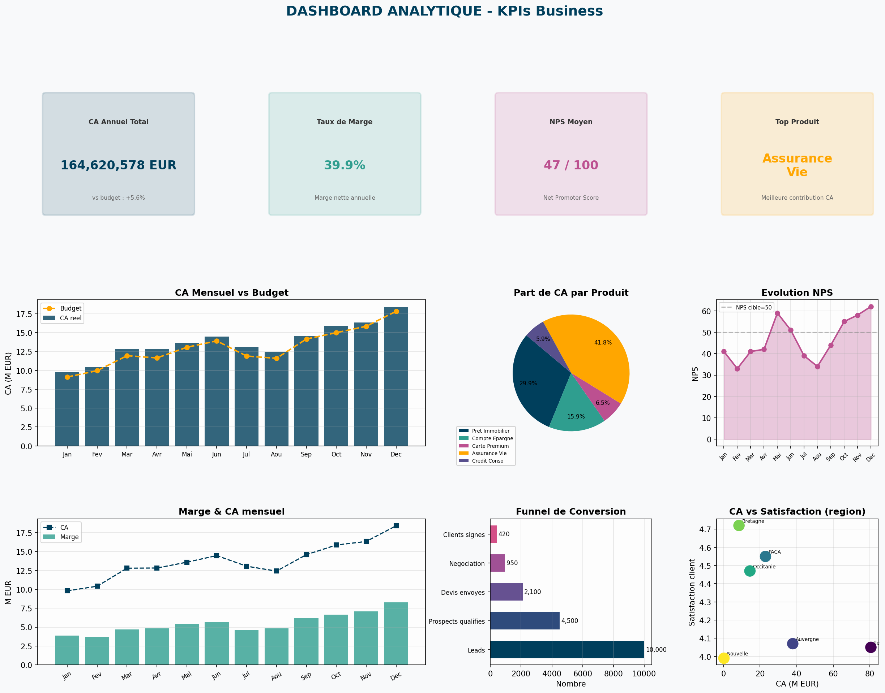

# 📊 Dashboard Analytique — KPIs Business

Dashboard de reporting analytique complet généré en Python avec matplotlib. Simule un tableau de bord business pour un portefeuille de produits financiers (CA, marges, NPS, satisfaction client).

## 📸 Aperçu



## 🎯 Fonctionnalités

- **4 KPI cards** : CA total, taux de marge, NPS moyen, top produit
- **Courbe CA mensuel vs budget** avec visualisation des écarts
- **Pie chart** de répartition CA par produit
- **Évolution NPS** avec cible sur 12 mois
- **Analyse marge mensuelle** superposée au CA
- **Funnel de conversion** commerciale (Leads → Clients signés)
- **Scatter CA vs satisfaction** par région
- Export automatique CSV + JSON

## 📈 KPIs générés

| Indicateur | Valeur |
|------------|--------|
| CA Annuel | 164,6 M EUR |
| Écart budget | **+5,6%** |
| Marge nette | **39,9%** |
| NPS moyen | 46,6 / 100 |
| Top produit | Assurance Vie |
| Meilleur mois | Décembre |

## 🗂️ Structure

```
dashboard-analytique/
├── dashboard.py           # Script principal
├── data/
│   ├── kpis_mensuel.csv   # Données mensuelles
│   ├── kpis_produit.csv   # Données par produit
│   ├── kpis_region.csv    # Données par région
│   └── synthese_kpis.json # Synthèse JSON
├── docs/
│   └── screenshot_dashboard.png
├── requirements.txt
└── README.md
```

## ⚙️ Installation

```bash
pip install -r requirements.txt
```

## 🚀 Utilisation

```bash
python dashboard.py
```

Génère `dashboard_kpis.png` (8 graphiques) + exports CSV/JSON dans `data/`.

## 🛠️ Technologies

**Python 3** · **matplotlib** · **pandas** · **numpy** · **json**

## 👩‍💻 Auteure

**Vanelle Stéphanie MANGOUA DJOUSSEU** — Recherche d'alternance en IA & Systèmes Embarqués
